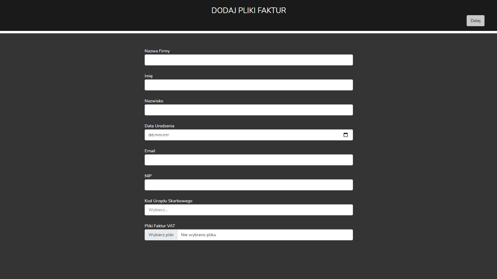
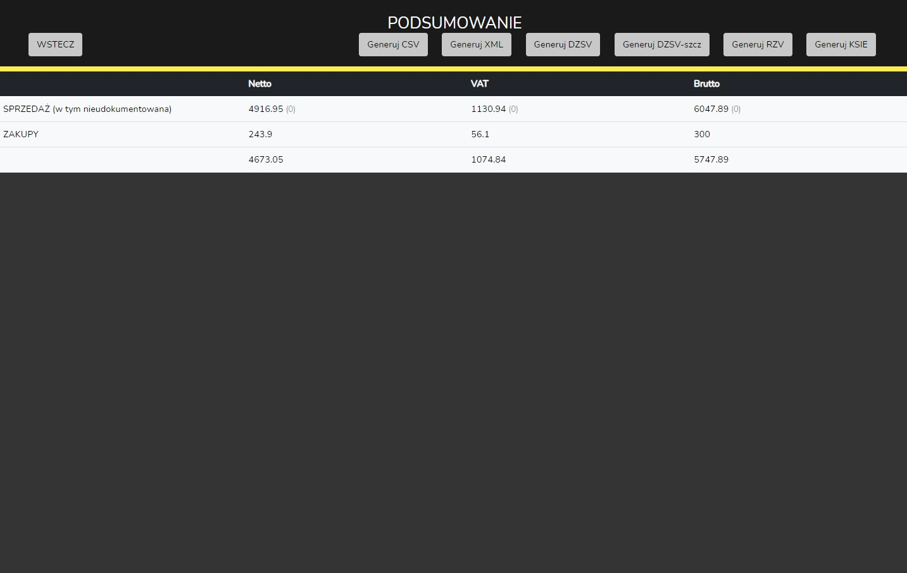

# BINAR
This is a tax settlement program for a specific company. Allows to:
* create JPK(.csv) files for monthly settlements
* create JPK (.xml) files for monthly settlements
* create .ods files for monthly settlements
	
## Technologies
Project is created with:
* PHP 8.0.2
* Laravel 8.44
* Bootstrap 5
* Spout Library, PhpSpreadsheet Library
* jQuery

## Functionality
* Reading sales invocices data from ods file
* Highlighting similar invoices and invoices with the GTU code
* Adding undocumented sales from the sales statement files (.csv) from Allegro
* Editing and deleting data from sales statement files
* Adding undocumented sales via the form
* Adding purchase invoices via the form
* Generating tax settlements files (.csv, .xml, .ods)

